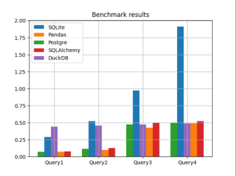

# **Бенчмарк для сравнения SQL библтотек на  Python**
**Бенчмарк для сравнения SQL библиотек**

# Результаты запуска бенчмарка:
Результаты запуска бенчмарка на файле 200Мб.
```
SQLite  0.2944303512573242 0.5844074249267578 0.9992326259613037 1.9139262914657593
Pandas  0.05390393733978272 0.09968492984771729 0.42450475692749023 0.4915184497833252
Postgre  0.07272913455963134 0.11432993412017822 0.4780056238174438 0.5016631841659546
SQLAlchemy  0.07695693969726562 0.12922885417938232 0.4997319459915161 0.5230615139007568
DuckDB  0.44207353591918946 0.4554939031600952 0.47269744873046876 0.4977170467376709
```
 

При запуске, программа в консоль выводит среднее время выполнения запроса для каждой библиотки и затем рисует график

На графике видно, что библиотека SQLite работает медленнее всего, кроме первого запроса.

Самой быстрой библиотекой является Pandas.

Pandas, Postgre, SQLAlchemy по скорости работают примерно одно и тоже время. Время их работы зависит от сложности запроса. На простох запросах данные библиотеки работают быстрее других, на сложных запросах работают примерно как DuckDB.

DuckDB работает на всех запросах одинаково по времени, не зависимо от сложности запроса 

# SQLite
**Впечатления**

Для работы с данной библиотекой нужно создавать .bd файл, что очень неудобно. Данную библиотеку можно использовать на небольших объемах данных в .bd файле, тк с болшими объемами данных, данная бибилотека показывает худший результат.

# Pandas

Pandas использует оптимизированные сткрутуры данных и способы выполнения операций, что позволяет данной бибилотеке эффективно обрабатывать данные.

**Впечатления**

Довольно хорошая библиотека, но скорость выполнения запросов зависит от подключенной базы данных.

# Psycopg2

Данная библиотека работает на основе postgres -> у данной библиотеки высокая производительность.

**Впечатление**

Простое подключение и найстройка базы данных. Довольно простая и удобная работа с запросами. На мой взгляд, самая удобная библиотека для работы с базами данных.

# SQLAlchemy

**Впечатление**

В начале не понимал, как работать с данной библиотекой, пришлось потратить довольно много времени на изучение SQLAlchemy. Также, данная библиотека выручила меня при работе с другими, а именно create_engine.

# DuckDB

**Впечатления**

Работа с данной библиотекой происходит очень просто, тк не надо подключаться к базе данных, а вся работа происходит с самим .csv файлом. Однако это сказывается на времени исполнении простых запросов. 

# Запуск

Необходимо склонировать репозиторий

```
git clone https://github.com/Blxssy/DB3.git
```

Далее нужно установить библиотеки

```
pip install -r ../requirements.txt
```

Далее настроить файл config.py

Запустить файл **main.py** и ждать результат.